# Qwen-Image-2.1 ncnn Vulkan

:exclamation: :exclamation: :exclamation: More features and optimizations in progress


ncnn implementation of [Qwen-Image-2.1](https://github.com/QwenLM/Qwen-Image-2.1), with text-to-image, image editing, multi-reference image input and transparent RGBA output.

qwenimage-ncnn-vulkan uses [ncnn project](https://github.com/Tencent/ncnn) as the universal neural network inference framework.

## Features

<table>
<tr>
<td>

- Full **BF16** model precision, no quantization
- Works with **2GB** VRAM, no CPU offload
- **NVIDIA / AMD / Intel / Apple Silicon**
- **Windows / Linux / macOS**
- **CPU** inference is also supported
- **No** CUDA / PyTorch / Python dependency
- **Portable** standalone executable

</td>
<td>

- Text-to-image
- Image **editing**
- Up to **10** reference images
- **Transparent** RGBA image generation
- **Dynamic** output resolution
- **Batch** generation
- Qwen-Image-2.1-Fun-Acc-LoRAs (**4steps**)
- **ControlNet** (pose, canny, etc.)

</td>
</tr>
</table>

RX9060XT qwem-image-2.1 text-to-image 1024x1024
|dit transformer step|(s/it) less is better|
|:-:|:-:|
|torch-nightly (rocm10.0.0) 20260923|6.12|
|stable-diffusion.cpp (vulkan) 20260927|5.31|
|qwenimage-ncnn-vulkan 20260928|4.17|

## [Download](https://github.com/nihui/qwenimage-ncnn-vulkan/releases)

Download Windows/Linux/macOS Executable for Intel/AMD/NVIDIA/Apple-Silicon GPU

**https://github.com/nihui/qwenimage-ncnn-vulkan/releases**

This package includes all the binaries required. It is portable, so no CUDA, PyTorch or Python runtime environment is needed :)

### prepare model files

Download the qwenimage21 model folder:

https://huggingface.co/nihui-szyl/qwen-image-ncnn

Put it under the `models/` directory when running from the source tree, or pass its path with `-m`.

```
qwenimage-ncnn-vulkan
models/
    qwenimage21/
        controlnet/
            controlnet.ncnn.param
            controlnet.ncnn.bin
        processor/
            vocab.txt
            merges.txt
        text_encoder/
            text_encoder.ncnn.param
            text_encoder.ncnn.bin
        vision/
            vision_encoder.ncnn.param
            vision_encoder.ncnn.bin
            vision_pos_embed.f32
        transformer/
            input.ncnn.param
            input.ncnn.bin
            blocks.ncnn.param
            blocks.ncnn.bin
            output.ncnn.param
            output.ncnn.bin
        vae/
            encoder.ncnn.param
            encoder.ncnn.bin
            decoder.ncnn.param
            decoder.ncnn.bin
```

One model package supports text-to-image and image editing, dynamic output sizes and up to ten reference images.

## About Qwen-Image-2.1

Qwen-Image-2.1: A unified text-to-image generation and image editing model open-sourced by the Qwen team. With a 7B parameter visual component across 32 Single-Stream DiT layers, it balances generation quality, inference efficiency, and versatility.

https://github.com/QwenLM/Qwen-Image-2.1

## Usages

### requirements

- Minimum (Linux / macOS): 16GB RAM, any Vulkan capable GPU

- Minimum (Windows):

  *Due to WDDM limitations: Vulkan applications can only use half of the system RAM.*

  *The following condition shall be met:* **(Half of system RAM) + (GPU memory) >= 16GB**

  Examples of valid combinations:
  - Any amount RAM, 16GB dedicated GPU
  - 16GB RAM, 8GB dedicated GPU
  - 24GB RAM, 4GB dedicated GPU
  - 32GB RAM, any Vulkan capable GPU

- Recommended: 32GB RAM, 16GB dedicated GPU with tensorcore/matrix hardware

- Low-VRAM mode and VAE encoder/decoder tiling adapt automatically to the available GPU memory at the start of each generation

- CPU inference is available with `-g -1`

Earlier text-to-image memory measurements before prefix KV caching (RTX 3060, BF16, 2 steps):

| Image resolution | Example VAE tile | Peak VRAM (MiB) |
|---|---|---:|
| 512x512 | 256x256 | 531.6 |
| 1024x1024 | 256x256 | 1027.3 |
| 1024x1024 | 512x512 | 1486.5 |
| 2048x2048 | 512x512 | 3411.1 |
| 2048x2048 | 1024x1024 | 4970.6 |

These historical measurements are examples, not current minimum VRAM guarantees. Current memory requirements also depend on prompt length and KV caches. Tile sizes are selected automatically from the current memory budget and may be larger when more memory is available. No manual low-VRAM or tile setting is required.

The peaks are VRAM increments over the usage before the process starts. Allow additional GPU memory for the driver, desktop and other applications when choosing a graphics card.

Image editing also accounts for reference image sizes and negative prompts when choosing its memory policy. When needed, reference KV caches are kept in system RAM and transferred one Transformer block at a time. More reference images require more system RAM and may take longer to process. VAE encoder and decoder tile sizes are selected independently. If the estimated Transformer workspace or full-image VAE attention cannot fit even with offloading and tiling, generation stops with an insufficient-memory error; reduce the output or reference image sizes, or use fewer references.

### Example Command

Text to image

```shell
qwenimage-ncnn-vulkan -p "A small red kite over a quiet lake." -o output.png
```

Text to image with a negative prompt

```shell
qwenimage-ncnn-vulkan -p "A small red kite over a quiet lake." -n "blurry image, dull colors" -w 4 -o output.png
```

The -w value maps to Torch true_cfg_scale and defaults to 1.0. The negative prompt participates in CFG only when -w is greater than 1.

Image editing

```shell
qwenimage-ncnn-vulkan -i input.png -p "Change the clothes to a blue jacket." -o output.png
```

Load a safetensors LoRA, including PEFT `lora_A` / `lora_B` adapters

```shell
qwenimage-ncnn-vulkan --lora qwen-image-style.safetensors --lora-scale 0.8 -p "A red flower." -o output.png
```

Some Qwen Fun Acc adapters use a fixed step schedule. For example, the 4-step adapter requires `-l 4`.

ControlNet generation

```shell
qwenimage-ncnn-vulkan -c control.png --control-scale 1.0 -p "A red flower." -o output.png
```

When `-c` is used, ControlNet loads by default from `<model-path>/controlnet/controlnet.ncnn.param` and its matching `.bin` file; `--controlnet` can override the model path. ControlNet can also be combined with `-i` image editing and a LoRA. The model can be used with Canny, depth, grayscale, HED, lineart, MLSD, pose and scribble condition images.

Multiple reference images

```shell
qwenimage-ncnn-vulkan -i subject.png -i clothing.png -i background.png -p "Combine these references into one coherent image." -o output.png
```

Transparent image generation

```shell
qwenimage-ncnn-vulkan -p "A glass bottle on a transparent background." -o output.png
```

Set image size, denoise steps, seed and GPU

```shell
qwenimage-ncnn-vulkan -s 1024,1024 -l 40 -r 42 -g 0 -p "A red flower." -o output.png
```

Batch generation

```shell
qwenimage-ncnn-vulkan -b 4 -r 42 -p "A red flower." -o output.png
```

With `-b` greater than one, outputs are saved as `output-0.png`, `output-1.png`, and so on. Each image uses the next seed value. Use `-i` once for each reference image, up to ten images. Text-to-image sizes must be multiples of 16; image-editing sizes must be multiples of 32.

The default output is an RGBA PNG. A jpg or jpeg suffix writes RGB JPEG output, and a webp suffix writes lossless RGBA WebP output. PNG and WebP alpha can be used for transparent image generation.

### Full Usages

```console
Usage: qwenimage-ncnn-vulkan [options]...

  -h                   show this help
  -p prompt            prompt (default=A half-length portrait in the warm light of a convenience store late at night. An East Asian beauty, holding milk, meets your gaze in front of the freezer.)
  -n negative-prompt   negative prompt (optional)
  -w guidance-scale    true CFG scale (default=1.0)
  -o output-path       output image path (default=out.png)
  -i input-image       reference image for editing (repeat 1 to 10 times)
  -c control-image     ControlNet condition image (optional)
  --controlnet path    override default ControlNet model path (optional)
  --control-scale val  ControlNet strength (default=1.0)
  --lora path          LoRA or Qwen Fun Acc safetensors adapter (optional)
  --lora-scale value   LoRA strength (default=1.0)
  -s image-size        image resolution (default=1024,1024)
  -l steps             denoise steps (default=40)
  -r random-seed       random seed (default=rand)
  -m model-path        qwen-image model path (default=models/qwenimage21)
  -g gpu-id            GPU device to use (-1=cpu, default=auto)
  -b batch-size        batched generation (default=1)
```

If you encounter a crash or error, try upgrading your GPU driver:

- Intel: https://downloadcenter.intel.com/product/80939/Graphics-Drivers
- AMD: https://www.amd.com/en/support
- NVIDIA: https://www.nvidia.com/Download/index.aspx

## Build from Source

1. Clone this project with all submodules

```shell
git clone https://github.com/nihui/qwenimage-ncnn-vulkan.git
cd qwenimage-ncnn-vulkan
git submodule update --init --recursive --depth 1
```

2. Build with CMake

```shell
mkdir build
cd build
cmake ../src
cmake --build . -j 4
```

### Windows command-line encoding (UTF-8)

On Windows the C runtime decodes `argv` using the system ANSI code page, so a
non-ASCII prompt (for example Chinese) is mangled before it reaches the UTF-8
tokenizer and the rendered text comes out garbled. The build embeds an
application manifest (`src/app.manifest`) that declares
`<activeCodePage>UTF-8</activeCodePage>`, so command-line arguments are decoded
as UTF-8. The executable also sets the console output code page to UTF-8 at
startup, so a Chinese prompt echoed to the console is displayed correctly
instead of as mojibake. Requires Windows 10 version 1903 or newer.

## Sample Images

### Text to image

<table width="100%">
<tr>
<td width="31%">

<details>
<summary>expand for full command</summary>

```qwenimage-ncnn-vulkan.exe -p "A half-length portrait in the warm light of a convenience store late at night. An East Asian beauty, holding milk, meets your gaze in front of the freezer." -r 1527207263```

</details>


</td>
<td width="31%">

<details>
<summary>expand for full command</summary>

```qwenimage-ncnn-vulkan.exe -p "Create a sophisticated contemporary Chinese art exhibition poster, combining modern editorial graphic design with restrained traditional Chinese visual elements. The poster should have a refined, minimal, museum-quality aesthetic. Use a warm off-white textured paper background with subtle natural fibers. Incorporate an abstract ink landscape inspired by Chinese shanshui painting: distant misty mountains, a flowing river, soft black and gray ink washes, and a small accent of muted cinnabar red. The landscape should be elegant and atmospheric rather than highly detailed, leaving enough clean space for typography. Typography is the main focus of the poster. All Chinese text must be clearly legible, correctly written, and faithfully reproduced. Do not alter, misspell, duplicate, substitute, or invent any characters. The main title must read exactly:「山海之间」 Display the four Chinese characters prominently in the upper-middle area of the poster. Use large, elegant Chinese typography with a strong contemporary editorial feeling, inspired by refined Song-style Chinese type or sophisticated modern exhibition typography. The title should be visually dominant but not overly decorative. Below the main title, add the subtitle exactly:「东方艺术与当代视觉展」 Set it in smaller, clean Chinese typography with generous letter spacing and precise alignment. Near the lower section of the poster, include the following information exactly:「2026年10月18日 — 11月30日」「当代艺术馆」「水墨 · 山川 · 光影 · 新境」 Arrange these three lines with clear hierarchy, careful spacing, and professional grid-based alignment. Keep them smaller than the main title but fully readable. Add a very small English subtitle: 'BETWEEN MOUNTAINS AND SEAS' The English text should be secondary and understated, supporting the Chinese typography rather than competing with it. Use a carefully structured editorial layout with generous margins, deliberate negative space, subtle asymmetry, and a strong typographic grid. Integrate the ink landscape naturally around and behind the text without reducing readability. The composition should feel like a professionally designed poster for a major contemporary art museum. Use a restrained palette: warm ivory paper, charcoal black, soft ink gray, and one subtle cinnabar-red accent. The red accent may appear as a small seal-like geometric mark or a restrained graphic element. The final result should look like high-end professional Chinese graphic design photographed or scanned from a real printed exhibition poster: crisp typography, refined paper texture, excellent visual hierarchy, balanced spacing, subtle print texture, and sophisticated art direction. IMPORTANT: Render every Chinese character exactly as specified. Preserve the exact wording and punctuation. Do not generate any additional Chinese or English text beyond the text explicitly requested. Avoid garbled Chinese characters, pseudo-Chinese writing, incorrect characters, repeated text, random letters, excessive decorative calligraphy, crowded layout, cheap commercial advertising style, neon colors, gradients, 3D typography, glossy effects, cyberpunk aesthetics, excessive ornaments, logos, QR codes, watermarks, or unrelated text." -r 385448266```

</details>

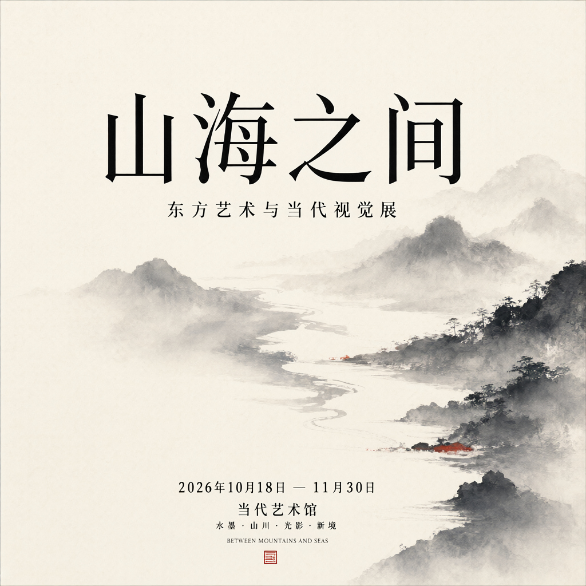

</td>
<td width="38%" rowspan="2">

<details>
<summary>expand for full command</summary>

```qwenimage-ncnn-vulkan.exe -p "A Yuan dynasty Chinese literati landscape painting in the manner of Ni Zan, traditional monochrome ink on paper, composed as a tall 1:2 vertical hanging scroll. Create a sparse yet visually rich and well-balanced composition, with restrained detail distributed across the full height of the painting rather than leaving excessively large empty areas. In the lower foreground, depict a gently sloping rocky riverbank with layered stones, several tall slender old trees, a few smaller shrubs, and a simple empty pavilion partially hidden among the trees. Add subtle clusters of reeds, low vegetation, exposed roots, and small irregular rocks along the shoreline. The foreground should have enough structure and texture to create a strong visual anchor while remaining elegant and uncluttered. Extend part of the foreground bank slightly toward the center of the composition, and introduce a small secondary sandbar or low rocky islet in the middle distance. Add a few sparse trees or shrubs on this secondary landform to create spatial depth and visual rhythm. The middle ground should contain calm open water, but not be completely empty. Use extremely subtle horizontal ink traces, faint ripples, and barely visible tonal variations to suggest water while preserving the feeling of stillness. Allow some blank paper to remain visible, but avoid an excessively large uninterrupted empty area. Across the water, depict a more developed distant shoreline with low hills, scattered tree silhouettes, and several overlapping mountain forms rendered in pale ink. The distant mountains should remain low, restrained, and atmospheric rather than dramatic, with several softly layered ridgelines creating depth. Use economical and refined brushwork, with pale ink, dry brush, rubbing, restrained hemp-fiber texture strokes, and subtle folding-ribbon brush accents. Preserve natural variations in ink density, dry-brush texture, and flying-white effects. The landscape should contain enough brushwork to feel complete and substantial, while still maintaining the simplicity and restraint of Yuan dynasty literati painting. The overall mood should be tranquil, austere, poetic, cool, refined, and contemplative. Maintain the detached elegance associated with Ni Zan, but avoid making the scene feel barren or unfinished. The painting should feel spacious rather than empty, layered rather than crowded, and quiet rather than desolate. Use negative space deliberately between groups of landscape elements, but distribute visual information throughout the composition. Keep a clear foreground, middle ground, and distant background, with several overlapping layers of shoreline, trees, rocks, water, and mountains. The visual density should be moderate: restrained and minimal, but not extremely sparse. In the upper-right area, add a small vertical Chinese calligraphic inscription written with a traditional brush. The calligraphy should feel natural, elegant, slightly archaic, and hand-written rather than typographic. The inscription must read exactly:「江天寥廓水雲間 獨坐亭中看遠山 萬籟俱寂心自遠 不知身在此塵寰 水竹院落」 Keep the inscription small and understated so that it does not dominate the landscape. Near the inscription, place one or two small traditional Chinese cinnabar seals, naturally integrated into the composition. Use one red-character seal and one white-character seal if possible. The seals should appear hand-stamped, with slightly irregular edges, subtle imperfections, and muted mineral-red cinnabar tones. The final image should resemble a well-preserved Yuan dynasty ink hanging scroll: ancient, restrained, elegant, layered, balanced, subtle, and contemplative. Avoid excessively empty composition, huge uninterrupted blank areas, modern Chinese illustration aesthetics, digital painting, watercolor effects, blue-and-green landscape painting, saturated colors, dramatic mountains, waterfalls, cloud seas, fantasy scenery, crowded figures, elaborate architecture, decorative borders, English text, modern typography, logos, or watermarks." -r 1944099538 -s 1024,2048```

</details>

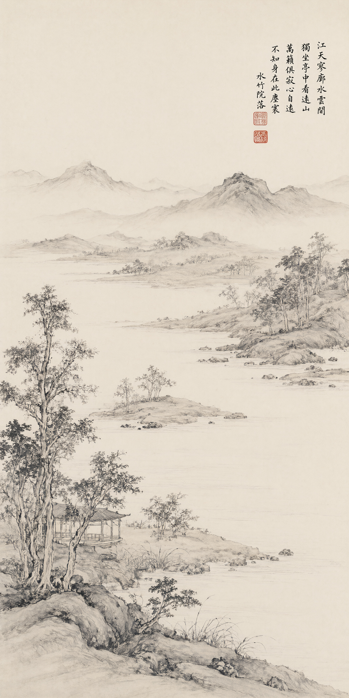

</td>
</tr>
<tr>
<td width="62%" colspan="2">

<details>
<summary>expand for full command</summary>

```qwenimage-ncnn-vulkan.exe -p "A highly realistic candid street photograph taken on a rainy evening in a dense East Asian city. A young woman in a dark charcoal coat walks alone along a narrow city sidewalk, holding a transparent umbrella. She is caught naturally in mid-step rather than posing for the camera. Her expression is calm and slightly thoughtful. Her face, skin texture, hair, hands, clothing folds, and proportions should look completely natural and anatomically correct. The street has just been soaked by rain. Wet asphalt and stone pavement reflect warm storefront lights, traffic signals, and subtle red, amber, and cool white highlights. Small puddles create imperfect broken reflections. Raindrops cling to the umbrella, glass windows, parked bicycles, metal railings, and street signs. A few distant pedestrians carrying umbrellas appear farther down the street, softly blurred by atmospheric perspective. The environment should feel lived-in and authentic: small restaurants, convenience stores, apartment entrances, utility boxes, bicycles, subtle signage, window condensation, slightly weathered walls, and ordinary urban details. Avoid an overly clean or staged environment. Use natural mixed lighting from shop windows, street lamps, and distant traffic. The woman's face is softly illuminated by warm reflected storefront light from one side, while the surrounding street remains slightly cool and subdued. Preserve realistic highlight roll-off and shadow detail. No dramatic studio lighting. Shot as professional full-frame street photography with a 50mm lens at approximately f/2.0, eye-level perspective, shallow but realistic depth of field. The woman is in sharp focus while the distant background gradually falls out of focus. Use subtle natural lens characteristics, realistic bokeh, mild high-ISO grain, and a restrained documentary color palette. The composition should feel spontaneous and observational, as if captured during a real evening walk. Slight asymmetry, natural visual clutter, believable perspective, realistic scale, and imperfect everyday details are important. Photorealistic skin, realistic hair strands, physically plausible wet surfaces, accurate reflections, natural fabric texture, realistic glass and metal materials, true-to-life lighting, high dynamic range, fine photographic detail. The final image should look like an authentic high-end documentary photograph captured with a real camera, not a digital painting or AI illustration. Avoid beauty-retouched skin, plastic-looking faces, excessive skin smoothing, exaggerated cinematic lighting, oversaturated neon colors, cyberpunk aesthetics, fantasy elements, artificial symmetry, excessive bokeh, distorted anatomy, malformed hands, duplicated people, floating objects, unrealistic reflections, overly sharp HDR, CGI rendering, 3D render appearance, illustration, anime, watercolor, text overlays, logos, or watermarks." -r 85854995 -s 1280,720```

</details>

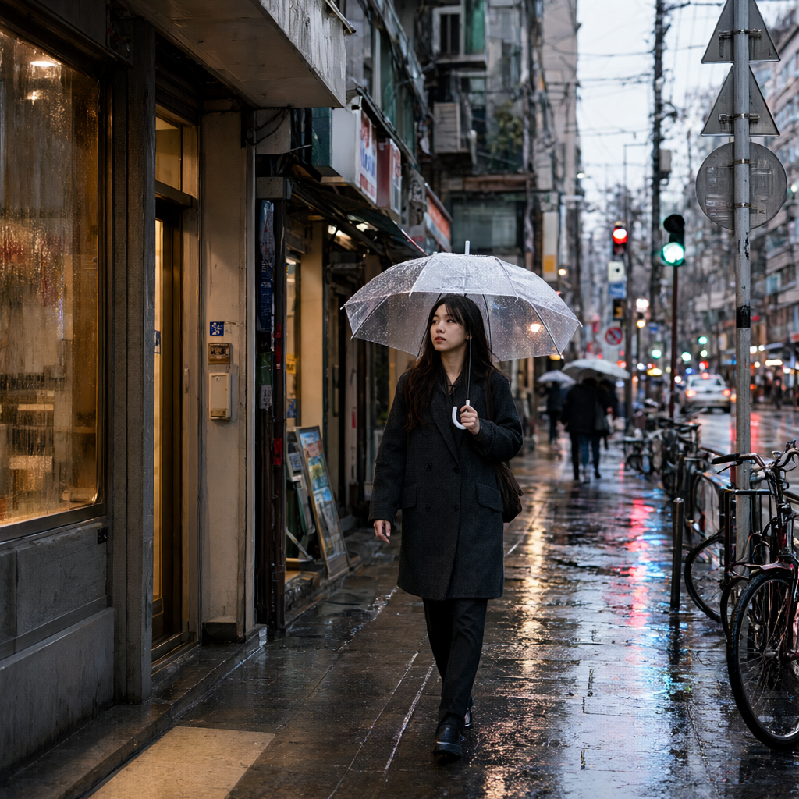

</td>
</tr>
</table>

<table width="100%">
<tr>
<td width="37%">

<details>
<summary>expand for full command</summary>

```qwenimage-ncnn-vulkan.exe -p "A highly realistic wildlife photograph of a red fox standing quietly in a snowy winter forest at dawn. The fox is the clear main subject, shown in a natural three-quarter view at eye level, with its head slightly turned toward the camera and an alert yet calm expression. Its anatomy and proportions are completely natural and accurate. Render exceptionally detailed reddish-orange fur with individual strands, soft dense winter undercoat, subtle color variation, white fur on the chest and muzzle, darker legs, black-tipped ears, long whiskers, moist nose, and bright amber-brown eyes with realistic reflections. Fine snowflakes cling naturally to the fur around its back, ears, and muzzle. The fox stands on fresh powder snow with believable paw impressions and slightly compressed snow beneath its feet. Surround it with a quiet conifer forest of pine and spruce trees, snow-covered branches, scattered dry grass, fallen twigs, and soft morning mist between the trees. Warm golden sunrise light filters gently through the cold blue-gray forest, creating subtle rim light along the fox’s fur while preserving natural shadow detail and realistic color. Use authentic professional wildlife photography aesthetics, shot with a full-frame camera and a 300mm telephoto lens at approximately f/4, with the fox sharply focused and the distant forest softly blurred by natural depth of field. Include realistic lens compression, delicate background bokeh, subtle high-ISO grain, physically plausible lighting, accurate snow texture, and restrained natural color grading. The scene should feel spontaneous and documentary-like, as if captured by a wildlife photographer in a real forest, not staged or posed. The final image must look indistinguishable from a real high-resolution wildlife photograph. Avoid cartoon style, illustration, anime, fantasy elements, anthropomorphic features, smiling human-like expressions, exaggerated eyes, malformed anatomy, extra limbs, duplicate animals, overly smooth fur, plastic texture, excessive HDR, oversaturated colors, artificial studio lighting, CGI, 3D render appearance, text, logos, borders, or watermarks." -r 1462200376```

</details>

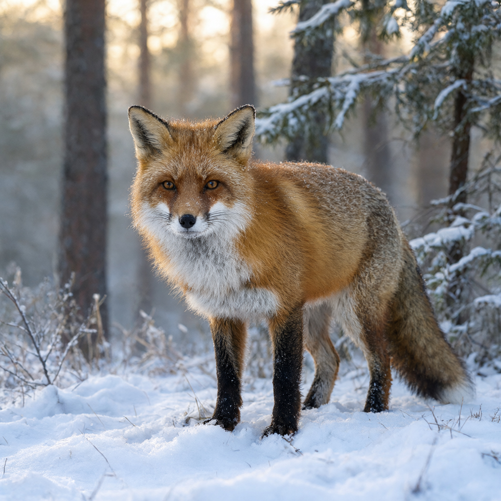

</td>
<td width="63%">

<details>
<summary>expand for full command</summary>

```qwenimage-ncnn-vulkan.exe -p "An authentic Minecraft gameplay screenshot in first-person view, 16:9 composition, showing a beautiful survival world at golden hour. The player stands on a grassy hillside overlooking a detailed valley with a winding river, dense oak and birch forests, terraced farmland, a small village with wooden and stone houses, and a cozy player-built survival base with warm lantern light glowing from the windows. In the distance, dramatic blocky mountains rise above the valley, with patches of snow near the peaks and soft square clouds drifting through a warm orange-blue sunset sky. Include recognizable Minecraft-style voxel geometry, cubic blocks, pixelated textures, blocky trees, grass, stone, water, crops, fences, torches, lanterns, and paths, all constructed entirely from discrete cube-based blocks with no smooth or realistic geometry. Add a few passive mobs such as cows, sheep, and chickens naturally distributed around the landscape. The river reflects the evening sky with the characteristic block-based Minecraft water appearance. Use attractive but believable in-game lighting with soft sunlight, ambient shadows, subtle volumetric rays, and gentle water reflections, resembling Minecraft with high-quality shaders while still clearly preserving the original blocky game aesthetic. Show a convincing first-person game HUD: a small white crosshair at the center, pixel-art hearts and hunger icons, an experience bar, and a nine-slot hotbar along the bottom edge containing recognizable tools and building materials, with no additional menus or text. The image must look exactly like a high-quality screenshot captured during actual Minecraft gameplay, not concept art, not a painting, not photorealistic terrain, and not a generic voxel illustration. Preserve strict cubic geometry, pixelated textures, consistent block scale, coherent world generation, believable Minecraft construction, and accurate first-person perspective. Avoid rounded terrain, smooth realistic trees, realistic human characters, non-blocky objects, excessive cinematic blur, depth-of-field photography, text overlays, logos, watermarks, or any interface elements other than the normal gameplay HUD." -r 442296602 -s 1280,720```

</details>

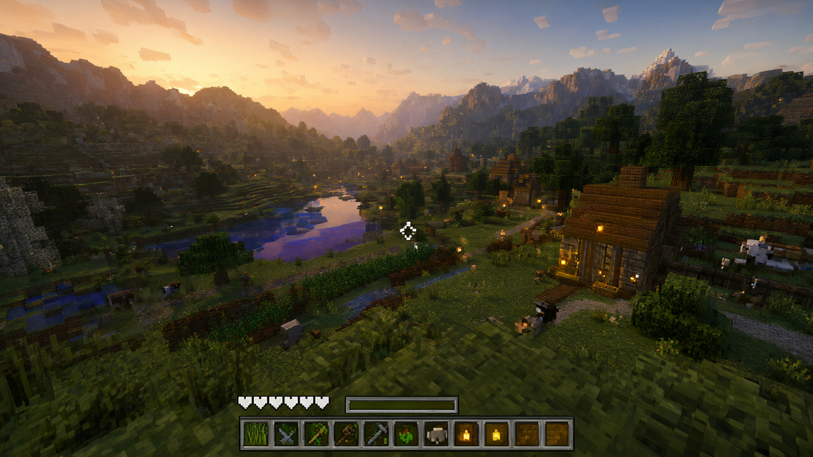

</td>
</tr>
</table>

### Qwen-Image-2.1-Fun-Acc-LoRAs (4 steps)

https://huggingface.co/alibaba-pai/Qwen-Image-2.1-Fun-Acc-LoRAs

<table width="100%">
<tr>
<td width="33%">

<details>
<summary>expand for full command</summary>

```qwenimage-ncnn-vulkan.exe -p "A half-length portrait in the warm light of a convenience store late at night. An East Asian beauty, holding milk, meets your gaze in front of the freezer." --lora Qwen-Image-2.1-Fun-Acc-4Step.safetensors -l 4 -r 42```

</details>

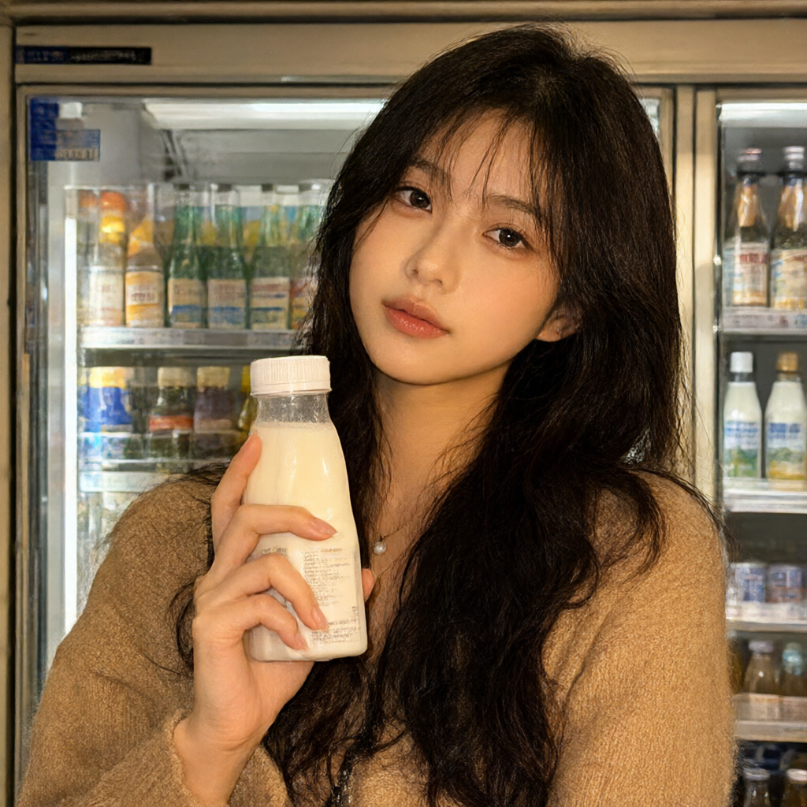

</td>
<td width="33%">

<details>
<summary>expand for full command</summary>

```qwenimage-ncnn-vulkan.exe -p "A highly realistic front-facing ID-style portrait photograph of a young white European boy, centered composition, looking directly into the camera, head straight and level, both ears and all facial features naturally visible, symmetrical frontal pose, neutral calm expression with closed mouth, natural childlike facial proportions, fair skin with subtle natural variation, clear light-colored eyes, neatly combed short light-brown hair kept away from the face, no makeup, no jewelry, wearing a simple plain light-colored collared shirt with no logos or patterns. Frame the portrait from the upper chest to slightly above the head, with balanced headroom and both shoulders fully visible. Use a clean solid light-gray background with no texture, objects, shadows, gradients, or decorations. Soft even studio lighting from the front, minimal facial shadows, accurate natural skin tones, sharp focus across the entire face, realistic hair strands, high photographic detail, restrained color reproduction, professional passport-photo and school-ID-photo aesthetics, natural 85mm portrait-lens perspective, no shallow depth of field, no dramatic lighting, no beauty retouching, no skin smoothing, no exaggerated facial features. The final image should look like a genuine professionally photographed identification portrait of a European child, not a fashion portrait or artistic photograph. Avoid tilted head, side view, smiling with teeth, exaggerated expression, adult-looking facial features, facial hair, heavy styling, hats, glasses, hair covering the eyes, cropped head, asymmetrical shoulders, dramatic shadows, colorful background, environmental scenery, cinematic grading, bokeh, illustration, anime, CGI, 3D rendering, text, logos, borders, or watermarks." --lora Qwen-Image-2.1-Fun-Acc-4Step.safetensors -l 4 -r 2033503473```

</details>

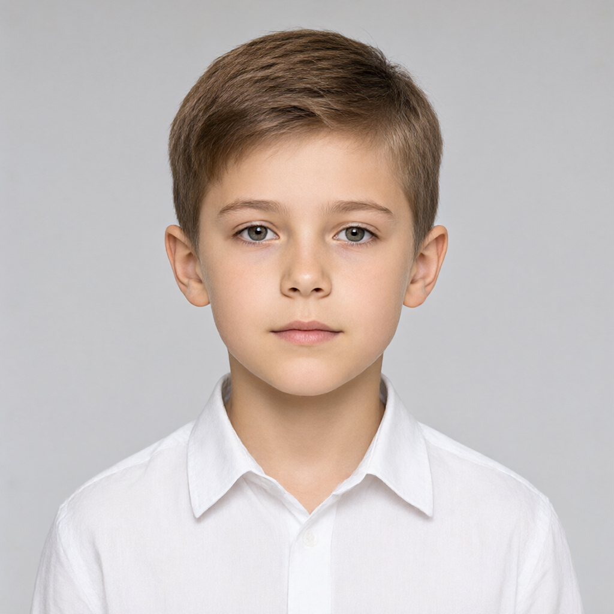

</td>
<td width="33%">

<details>
<summary>expand for full command</summary>

```qwenimage-ncnn-vulkan.exe -p "A cinematic science-fiction concept art scene depicting a vast human settlement on a distant alien planet at twilight. In the foreground, a lone explorer in a detailed pressure suit stands on a rocky ridge, seen from behind at three-quarter view, looking toward an enormous futuristic city built across a wide valley. The city combines monumental architecture, layered megastructures, elevated transit lines, glowing industrial facilities, research towers, landing platforms, and dense clusters of smaller buildings, all designed with believable engineering logic and realistic scale. A colossal orbital-elevator tower rises from the center of the city and disappears into the upper atmosphere, connected to a thin luminous tether extending toward space. Several spacecraft and cargo shuttles move through the sky at different distances, while small autonomous rovers and utility vehicles travel along illuminated roads below. The alien landscape features dark basalt cliffs, wind-carved rock formations, shallow reflective mineral lakes, sparse crystalline vegetation, and distant mountains fading into atmospheric haze. Two large moons are visible above the horizon, one partially illuminated, with a faint planetary ring crossing the sky. Use dramatic but physically plausible twilight lighting: cool blue ambient light from the sky, warm amber and white city lights, subtle volumetric haze, long soft shadows, atmospheric perspective, realistic reflections, and restrained lens effects. Emphasize a powerful sense of scale, depth, exploration, and technological civilization. The explorer should be small compared with the city and landscape, serving as a visual scale reference rather than dominating the composition. Render highly detailed hard-surface materials including brushed metal, ceramic armor, glass, composite panels, illuminated signage elements without readable text, cables, structural trusses, antennas, vents, and weathered industrial surfaces. Maintain coherent architecture and mechanical design throughout the image, with consistent perspective and believable construction. Use a wide 16:9 cinematic composition, strong foreground-middle-ground-background layering, sophisticated production-design aesthetics, realistic concept-art rendering, extremely detailed environment design, sharp focal detail with natural atmospheric falloff, and a refined blue-gray, charcoal, amber, and muted cyan color palette. The final image should look like premium science-fiction production concept art created for a major feature film or AAA game, visually spectacular but grounded in realistic materials, physics, architecture, and lighting. Avoid fantasy castles, magical effects, medieval elements, steampunk, exaggerated neon cyberpunk colors, chaotic random machinery, impossible geometry, distorted perspective, oversized characters, cartoon style, anime style, toy-like 3D rendering, excessive bloom, excessive lens flare, blurry details, readable text, logos, borders, or watermarks." --lora Qwen-Image-2.1-Fun-Acc-4Step.safetensors -l 4 -r 816285834```

</details>

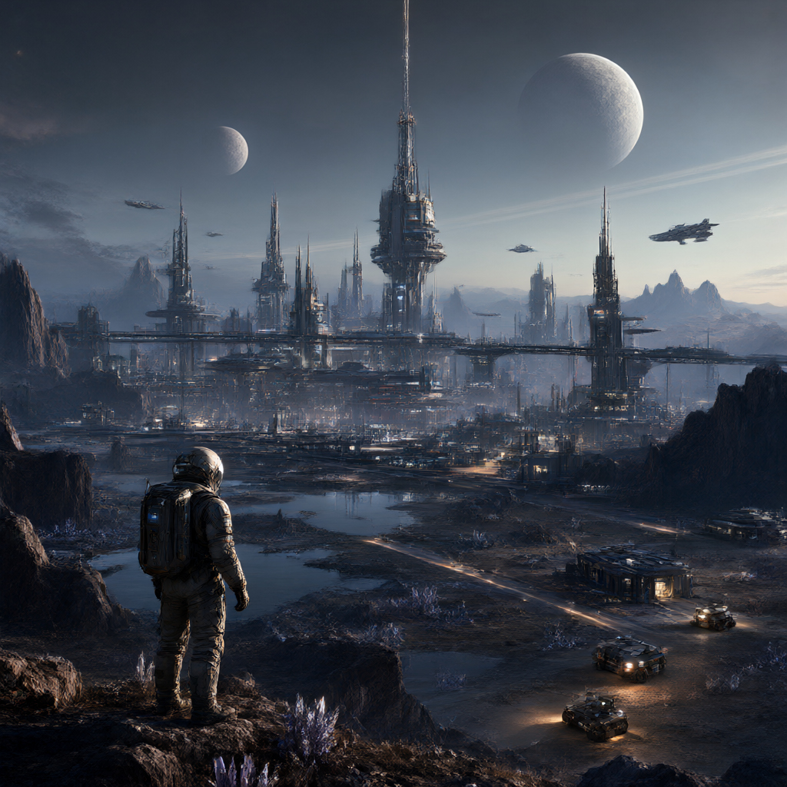

</td>
</tr>
</table>

### Image editing

<table width="100%">
<tr>
<td colspan="4">

<details>
<summary>expand for full command</summary>

```qwenimage-ncnn-vulkan.exe -i dafeiyu.jpg -p "Edit the provided character reference sheet while strictly preserving the original character identity and the three-view layout. Keep exactly the same chibi girl character, including her face, facial expression, large blue eyes, dark blue hair color, hairstyle, bangs, ahoge, hair length, body proportions, and overall silhouette. Strictly preserve her original height-to-head ratio and overall chibi proportions. Do not make her taller, shorter, slimmer, or more mature-looking. The two large fish-fin ornaments above the left and right sides of her head must be preserved exactly as key design features. Also preserve the fish tail behind her body as an essential original feature. Keep these elements clearly visible and fully integrated into the new design in all appropriate views. Preserve the exact three-view character sheet layout: front view, side view, and back view. Keep the same poses, viewing angles, spacing, scale, framing, and sheet arrangement as in the input image. Replace her entire navy-blue maid outfit with an elegant traditional Chinese hanfu-inspired outfit. The new outfit should use a refined blue-and-white color palette that harmonizes with her original hair color. Design it with a white cross-collar inner garment, pale blue layered sleeves, a deep navy flowing outer robe, a high-waisted pleated skirt, delicate embroidered wave and cloud patterns, and subtle gold decorative details. Add a small stylized whale motif to the waist sash as a reference to the original character design. Remove the maid apron, maid collar, lace cuffs, maid skirt, and maid headband, but keep the fish-fin ornaments above both sides of the head. Integrate them naturally with the redesigned outfit. The fish tail behind the character must also remain unchanged in spirit and remain clearly visible. The edited costume must be geometrically consistent across all three views. Every garment layer, ribbon, sash, sleeve, embroidery pattern, accessory, fish-fin ornament, and tail placement should correspond correctly between the front, side, and back views. The back view must show the correct continuation of the robe, sash, skirt folds, hair, fish-fin ornaments, and tail. Preserve the original cute chibi anime illustration style, clean line art, soft cel shading, smooth color transitions, crisp outlines, and polished character-sheet appearance. Keep the original plain light background clean and unchanged. This should look like the same character wearing a completely redesigned traditional Chinese outfit, not a newly generated character. Do not change the character's face, eyes, hairstyle, hair color, fish-fin ornaments, fish tail, body proportions, height ratio, pose, expression, viewpoint, framing, image dimensions, or three-view arrangement. Do not add extra characters, extra limbs, extra accessories, text, labels, logos, decorative backgrounds, scenery, or watermarks." -r 2096415905 -s 1024,512```

</details>

</td>
</tr>
<tr>
<td width="30%" valign="middle">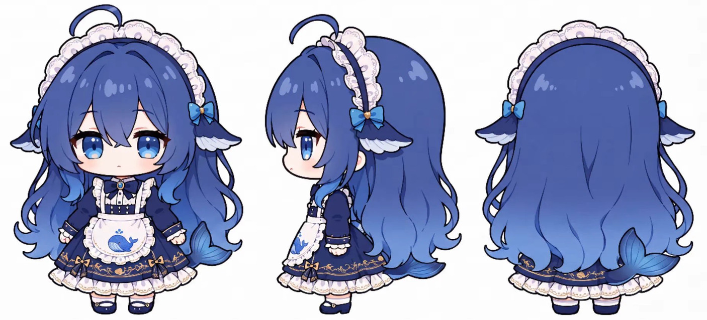</td>
<td width="1%" align="center" valign="middle">➡️</td>
<td width="30%" valign="middle">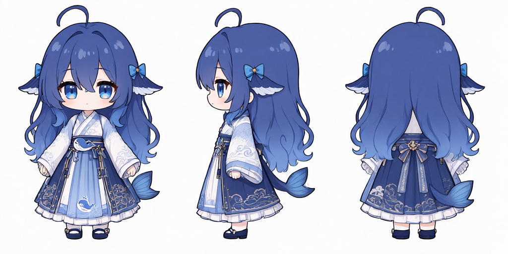</td>
</tr>
<tr>
<td colspan="4">

<details>
<summary>expand for full command</summary>

```qwenimage-ncnn-vulkan.exe -i dafeiyu.jpg -p "Use the provided reference image as the primary character design reference. Generate a completely new illustration featuring the same blue-haired chibi girl from the reference image. Preserve her character identity and all important recognizable design features, while creating a new pose, camera angle, composition, and environment. The character must retain the same dark cobalt-blue hair, long wavy hairstyle, distinctive bangs, single curved ahoge, large blue gradient eyes, small round face, blue-and-white lace maid headband, blue ribbon hair ornaments, navy-and-white maid dress, white frilled apron with the small blue whale emblem, gold decorative accents, and the distinctive small blue whale-tail feature behind her. Keep her proportions and visual identity consistent with the reference: very cute chibi proportions, oversized head, small body, short limbs, soft rounded facial features, and a gentle, slightly quiet expression. Do NOT reproduce the original three-view character sheet. Instead, create a single polished full-scene illustration. Place the character in a charming seaside café overlooking the ocean. She is standing in a natural three-quarter view, carrying a small silver serving tray with a cup of tea and a slice of cake. Her body is turned slightly toward the viewer, with one foot stepping forward, giving the pose a lively but gentle sense of motion. Behind her is a bright coastal café terrace with white wooden tables, blue fabric awnings, potted flowers, glass windows, and a sparkling blue sea in the distance. A light ocean breeze gently moves the ends of her long hair, her ribbons, and the frills of her dress. Small distant seabirds and soft white clouds add atmosphere without distracting from the character. Use soft daylight, clear blue sky, subtle warm sunlight, delicate shadows, and gentle reflected light from the sea. The lighting should make the blue hair and navy costume feel vivid while preserving soft pastel harmony. Maintain the same cute anime illustration style as the reference image: clean expressive line art, polished cel shading, soft gradients, crisp edges, carefully rendered fabric folds, lace details, hair highlights, and charming miniature character proportions. The character should clearly look like the exact same character from the reference image, not merely a similar blue-haired maid. Preserve the original hairstyle silhouette, facial design, eye color, costume motifs, accessories, whale emblem, and whale-tail feature. Create a cohesive, finished illustration rather than a model sheet or concept sheet. Use a balanced vertical composition with the character as the clear focal point and enough environmental detail to demonstrate a completely new scene. Do not add additional main characters. Do not redesign the character. Do not change her hair color, eye color, hairstyle, maid outfit identity, whale motif, or chibi proportions. Do not reproduce the front-side-back layout from the reference. Do not use a plain white background. Do not add text, labels, logos, signatures, or watermarks." -r 2096415905 -s 1024,512```

</details>

</td>
</tr>
<tr>
<td width="30%" valign="middle"></td>
<td width="1%" align="center" valign="middle">➡️</td>
<td width="30%" valign="middle">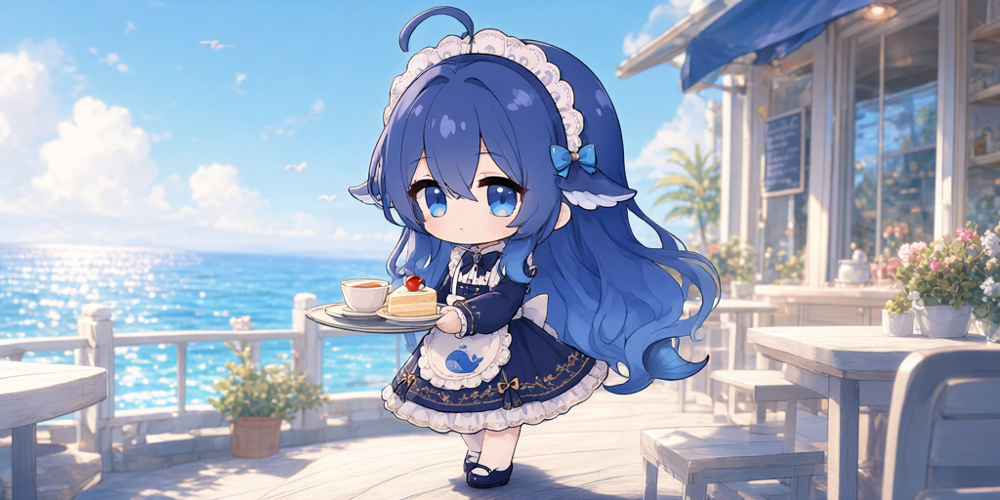</td>
</tr>
</table>

<table width="100%">
<tr>
<td colspan="4">

<details>
<summary>expand for full command</summary>

```qwenimage-ncnn-vulkan.exe -i beauty.jpg -i dafeiyu.jpg -p "Use both provided reference images together. Image A is the primary scene and identity reference: a photorealistic young woman in a convenience store, originally holding a milk bottle. Image B is the character design reference: a blue-haired chibi maid character shown in front, side, and back views. Generate a single finished image that keeps the woman, convenience-store environment, and overall photographic realism of Image A, while using Image B as the design reference for a new plush toy. Transform the character from Image B into a cute high-quality plush doll. The plush toy must clearly preserve the character's identity and recognizable features: long blue hair, large blue eyes, the maid headband, blue ribbon ornaments, navy-and-white maid outfit, white apron with the whale emblem, gold decorative details, and the small whale-tail feature. Convert all of these features into a soft stuffed-plush form with realistic fabric texture, embroidered facial features, visible plush seams, soft stuffing, rounded volume, and a premium cuddly toy appearance. In the final image, completely replace the milk bottle in the woman's hands with this plush toy. She is holding the plush gently with both hands and bringing it close to her face so that her cheek is softly touching the plush's face. Change her expression to clearly happy, warm, delighted, and affectionate, as if she loves the plush. The plush should also have a cheerful, adorable, happy expression. Preserve the woman's identity, hairstyle, facial structure, natural appearance, clothing, pose context, and the realistic convenience-store setting from Image A. Keep the refrigerated shelves, indoor lighting, perspective, framing, and casual candid-photography feeling. The result should remain photorealistic for the woman and environment, while the plush should look like a believable real-world stuffed toy physically present in the scene. Keep the woman as the main subject, keep the convenience-store background from Image A, make the plush fully replace the bottle, make the plush touch the woman's cheek naturally, and faithfully preserve the character design traits from Image B. Use realistic photography, natural indoor lighting, soft fabric, embroidery, seams, stuffed volume, subtle contact shadows, believable hand-to-plush interaction, and a cute heartwarming mood. Do not generate the original bottle, do not generate a flat illustration, do not reproduce the three-view character sheet, do not redesign the character into a different costume or color scheme, and do not add extra people, extra toys, text, logos, labels, or watermarks." -r 122747264```

</details>

</td>
</tr>
<tr>
<td width="63%" valign="middle"></td>
<td width="1%" align="center" valign="middle">➡️</td>
<td width="33%" valign="middle"></td>
</tr>
</table>

### ControlNet

<table width="100%">
<tr>
<td colspan="2">

<details>
<summary>expand for full command</summary>

```qwenimage-ncnn-vulkan.exe -c pose.jpg -p "A half-length portrait in the warm light of a convenience store late at night. An East Asian beauty, holding milk, meets your gaze in front of the freezer." -r 1227533815```

</details>

</td>
<td colspan="2">

<details>
<summary>expand for full command</summary>

```qwenimage-ncnn-vulkan.exe -c canny.jpg --control-scale 0.5 -p "A modern wooden cabin beside a calm alpine lake, surrounded by pine trees and distant mountains, warm sunset light, photorealistic, cinematic, highly detailed." -r 1343675211```

</details>

</td>
</tr>
<tr>
<td width="25%" valign="middle">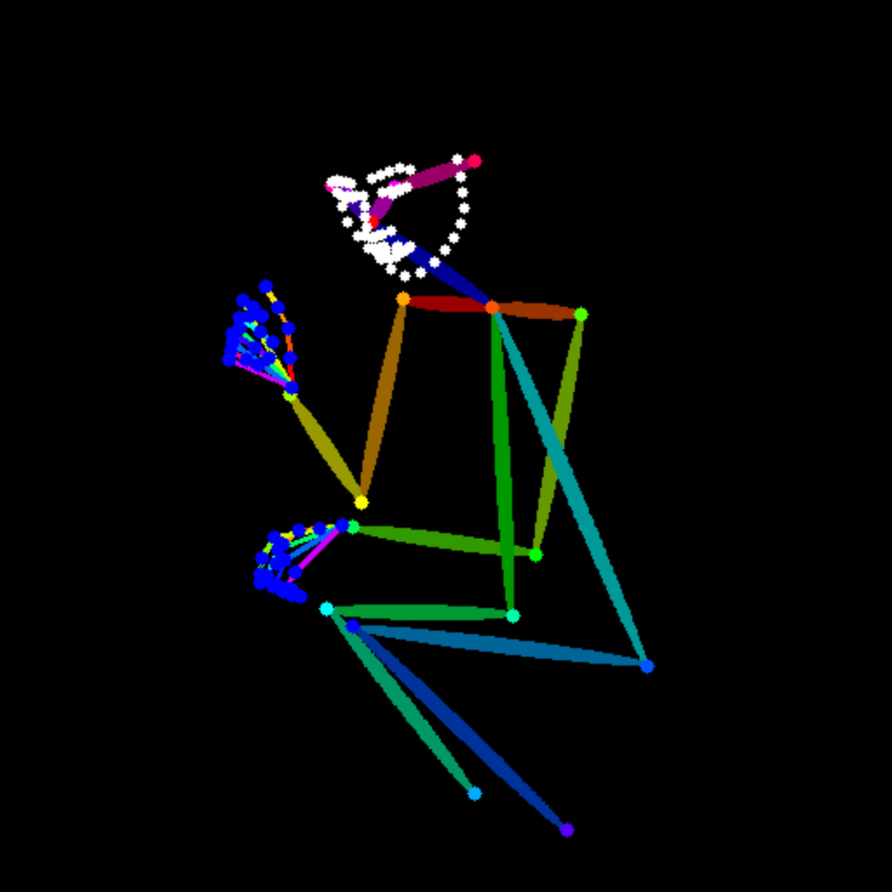
<td width="25%" valign="middle"></td>
<td width="25%" valign="middle">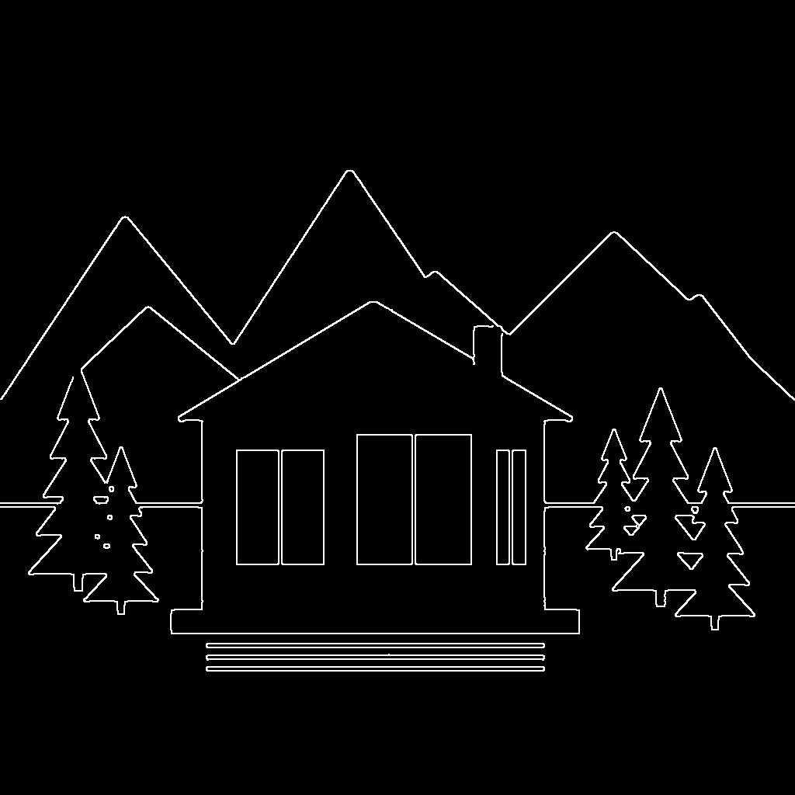
<td width="25%" valign="middle">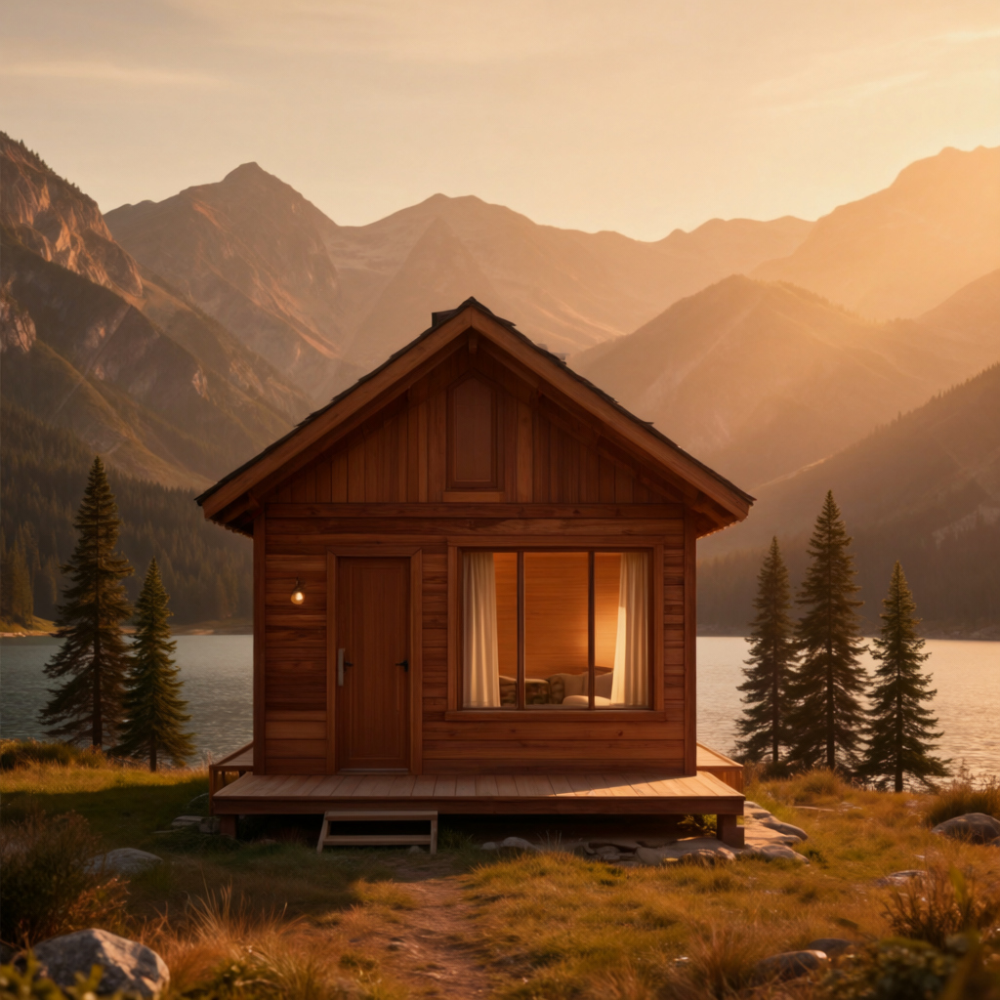</td>
</tr>
</table>

## Original Qwen-Image-2.1 Project

- https://github.com/QwenLM/Qwen-Image-2.1

## Other Open-Source Code Used

- https://github.com/Tencent/ncnn for fast neural network inference on ALL PLATFORMS
- https://github.com/futz12/ncnn_llm for BPE tokenizer
- https://github.com/webmproject/libwebp for encoding and decoding Webp images on ALL PLATFORMS
- https://github.com/libjpeg-turbo/libjpeg-turbo for encoding and decoding JPEG images on ALL PLATFORMS
- https://github.com/pnggroup/libpng for encoding and decoding PNG images on ALL PLATFORMS
- https://github.com/zlib-ng/zlib-ng for encoding and decoding PNG images on ALL PLATFORMS
- https://github.com/tronkko/dirent for listing files in directory on Windows

